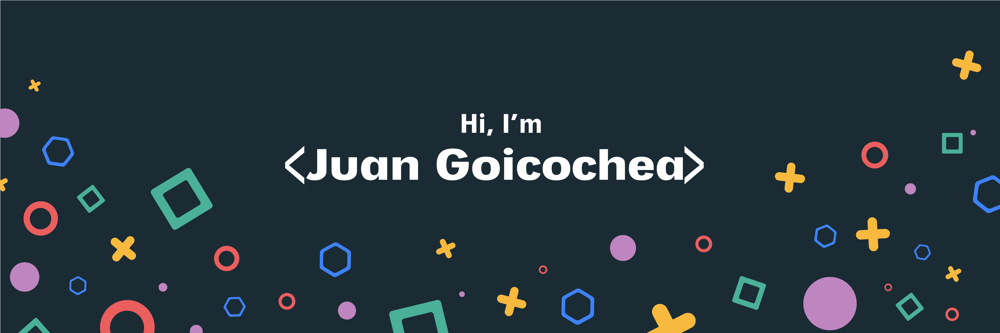

  

## Hey, I'm Juan 👋

Full Stack Developer specialized in building B2B web applications end-to-end.
Currently working at Tribier Business Intelligence (Cali, Colombia — Remote).

**What I build with:**
NestJS · Node.js · Next.js · TypeScript · PostgreSQL · GCP · Auth0 · MUI

**Recent work:**
- Role-based auth with Auth0 (OAuth 2.0 / OIDC)
- Recurring subscriptions with MercadoPago (pre-approval + webhooks)
- GCP deployments with Cloud Run + Cloud SQL — ensuring production stability
- Frontend performance optimization with react-window virtualization

📫 juancgoicochea@gmail.com  
🔗 linkedin.com/in/juan-goicochea

 
